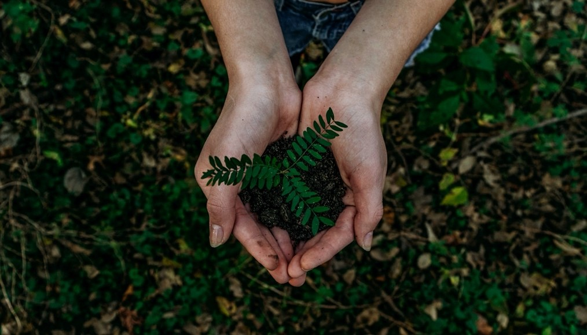
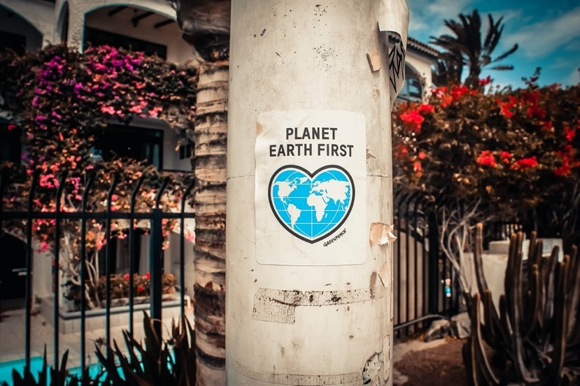
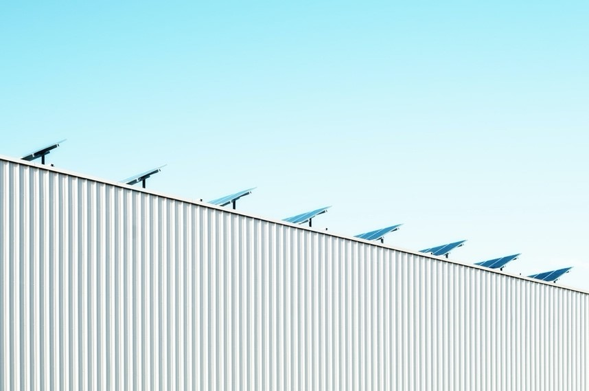

On 22nd April 2020, the world will be celebrating its fiftieth Earth Day — and not even the Coronavirus lockdown can stop that. Although the usual mass gatherings are out, for the first time Earth Day is going digital.

#### The Origins of Earth Day

Earth Day began in America in 1970, as a response to a catastrophic oil spill off the coast of California the previous year. An estimated twenty million people took part in demonstrations to raise awareness of environmental issues and demand a new way forward for the planet, and the event helped inspire a series of crucial environmental laws in the US.

On the twentieth anniversary, in 1990, Earth Day went global, with events in 141 countries, and it's continued to grow ever since. In 2016, Earth Day was chosen for the signing of the landmark Paris Agreement on combating climate change.

#### Earth Day 2020 

The focus for the fiftieth anniversary Earth Day was chosen to be the climate change crisis. It was an obvious choice — as Earth Day founder Denis Hayes points out, "Despite that amazing success and decades of environmental progress, we find ourselves facing an even more dire, almost existential, set of global environmental challenges".

A wide range of rallies and mass clean-ups were planned for the 22nd April, but of course, most of these have been hit by the lockdown. Fortunately, many online resources had already been prepared, and this aspect has been quickly expanded. 2020 will be the first Digital Earth Day.

#### What Can You Do? 

While you won't be able to march in the streets or join large clean-up groups, there are still many ways you can contribute to Earth Day. Besides doing your bit to clean up your local area as far as social distancing allows, there are plenty of online resources to make use of.

One of the original plans was a Citizen Science project, aiming to pool knowledge and resources to develop ways of combating climate change, and a smartphone app is available to help you take part. The educational materials can also be accessed online, and artists of all kinds can still take part in the Artists for the Earth project to personalise climate change.

And what about your own carbon footprint? If you haven't already taken steps to reduce it, why not make Earth Day 2020 the day to pledge action? For example, making your home more energy-efficient could contribute to reducing climate change, while saving you money at the same time. Get in touch with us to find out more.